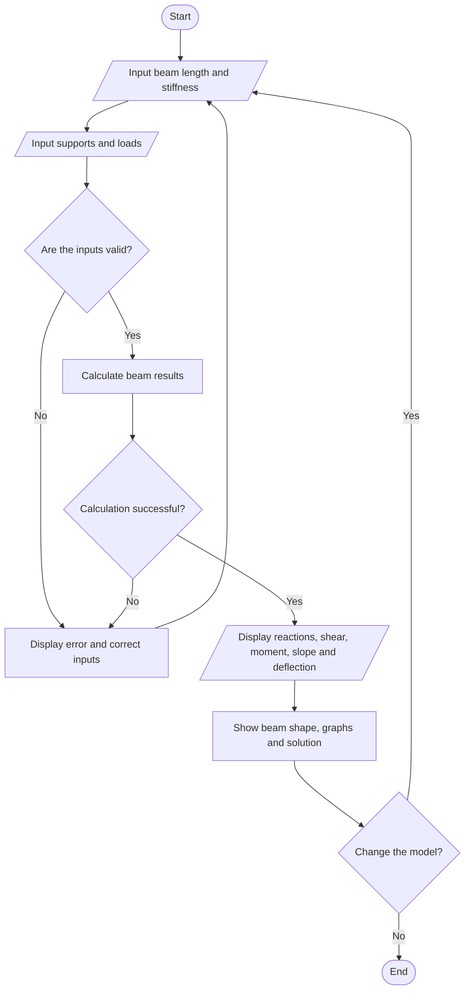

# Digital Multi-Load Beam Structural Analysis and Simulation System

## Program flowchart

```mermaid
flowchart TD
    A([Start]) --> B[/Input beam length and stiffness/]
    B --> C[/Input supports and loads/]
    C --> D{Are the inputs valid?}
    D -- No --> E[Display error and correct inputs]
    E --> B
    D -- Yes --> F[Calculate beam results]
    F --> G{Calculation successful?}
    G -- No --> E
    G -- Yes --> H[/Display reactions, shear, moment, slope and deflection/]
    H --> I[Show beam shape, graphs and solution]
    I --> J{Change the model?}
    J -- Yes --> B
    J -- No --> K([End])
```
