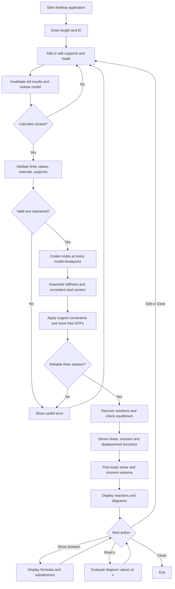

# Program flowchart

```mermaid
flowchart TD
    A[Start desktop application] --> B[Enter length and EI]
    B --> C[Add or edit supports and loads]
    C --> D[Invalidate old results and redraw model]
    D --> E{Calculate clicked?}
    E -- No --> C
    E -- Yes --> F[Validate finite values, intervals, supports]
    F --> G{Valid and restrained?}
    G -- No --> H[Show useful error]
    H --> C
    G -- Yes --> I[Create nodes at every model breakpoint]
    I --> J[Assemble stiffness and consistent load vectors]
    J --> K[Apply support constraints and solve free DOFs]
    K --> L{Reliable finite solution?}
    L -- No --> H
    L -- Yes --> M[Recover reactions and check equilibrium]
    M --> N[Derive shear, moment and displacement functions]
    N --> O[Find exact shear and moment extrema]
    O --> P[Display reactions and diagrams]
    P --> Q{Next action}
    Q -- Show Solution --> R[Display formulas and substitutions]
    R --> Q
    Q -- Read x --> S[Evaluate diagram values at x]
    S --> Q
    Q -- Edit or Clear --> C
    Q -- Close --> T[Exit]
```
